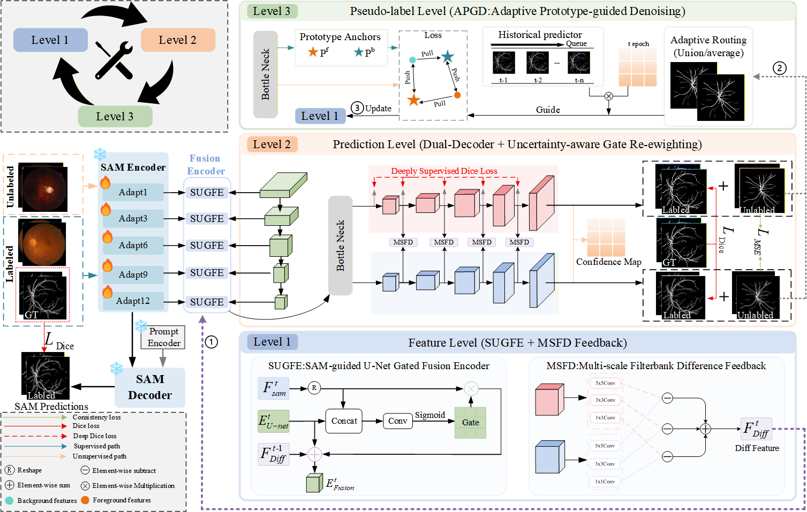

# HCNet: Hierarchical Iterative Self-Correction for Semi-Supervised Medical Image Segmentation

## Introduction

> [**HCNet: Hierarchical Iterative Self-Correction for Semi-Supervised Medical Image Segmentation**](PAPER_URL), <br/>

HCNet is a semi-supervised medical image segmentation framework designed to reduce confirmation bias caused by noisy pseudo-labels. The framework performs hierarchical iterative self-correction at the **feature**, **prediction**, and **pseudo-label** levels.


<div align="center">
  
</div>


## Installation

The recommended environment is:

- Python 3.9
- PyTorch 2.7.1
- CUDA 11.8

### Create the environment

```bash
conda create -n hcnet python=3.9 -y
conda activate hcnet
```

Install PyTorch:

```bash
pip install torch==2.7.1 torchvision==0.22.1 torchaudio==2.7.1 \
  --index-url https://download.pytorch.org/whl/cu118
```

Install the remaining dependencies:

```bash
pip install -r requirements.txt
```

Alternatively, create the Conda environment from the provided file:

```bash
conda env create -f environment.yml
conda activate hcnet
```

## Usage

### Dataset and Pre-processing

The current implementation supports paired 2D medical images and binary masks. Dataset-specific loaders for FIVES, OCTA, Kvasir-style, and pancreas-style data are included in `dataloaders/`.

Organize each dataset as follows:

```text
data/<DATASET_NAME>/
├── train/
│   ├── images/
│   └── masks/
├── val/
│   ├── images/
│   └── masks/
└── test/
    ├── images/
    └── masks/
```


Please download the datasets from their official sources and follow their corresponding licenses and usage policies.

### SAM Checkpoint

Download the official SAM ViT-B checkpoint:

```text
sam_vit_b_01ec64.pth
```

Place it in:

```text
checkpoints/sam_vit_b_01ec64.pth
```

The checkpoint path can also be specified using:

```bash
--sam_checkpoint /path/to/sam_vit_b_01ec64.pth
```

### Training Steps

1. Clone the repository:

```bash
git clone https://https://github.com/SCCONION/HCNet.git
cd HCNet
```

2. Create the data and checkpoint directories:

```bash
mkdir -p data checkpoints
```

3. Place the prepared dataset under `data/` and the SAM checkpoint under `checkpoints/`.

4. Train HCNet:

```bash
CUDA_VISIBLE_DEVICES=0 python train.py \
  --data_root ./data/FIVES \
  --exp FIVES \
  --sam_checkpoint ./checkpoints/sam_vit_b_01ec64.pth \
  --image_size 512 512 \
  --batch_size 4 \
  --labeled_bs 2 \
  --labelnum 54 \
  --max_iterations 8000 \
  --gpu 0
```

For a different annotation ratio, change `--labelnum` according to the number of labeled training images.

Example:

```bash
# Example for an extremely limited labeled setting
CUDA_VISIBLE_DEVICES=0 python train.py \
  --data_root ./data/FIVES \
  --exp FIVES_5percent \
  --sam_checkpoint ./checkpoints/sam_vit_b_01ec64.pth \
  --labelnum <NUMBER_OF_5_PERCENT_LABELED_SAMPLES> \
  --batch_size 4 \
  --labeled_bs 2 \
  --max_iterations 8000 \
  --gpu 0
```

Training outputs are saved in:

```text
models_result/<EXP>_<LABELNUM>labels/
├── log.txt
├── best_model.pth
└── iter_<ITERATION>.pth
```

### Evaluation

Evaluate a trained model using:

```bash
CUDA_VISIBLE_DEVICES=0 python test.py \
  --data_root ./data/FIVES \
  --split test \
  --model_path ./models_result/FIVES_54labels/best_model.pth \
  --sam_checkpoint ./checkpoints/sam_vit_b_01ec64.pth \
  --image_size 512 512 \
  --save_dir ./results/FIVES \
  --gpu 0
```

The evaluation script reports:

- Dice;
- IoU;
- Hausdorff distance;
- Accuracy;
- Sensitivity;
- Specificity;
- clDice, when enabled in the evaluation script.

Prediction masks and visualization results are saved under:

```text
results/<DATASET_NAME>/
```

## Main Components

```text
HCNet/
├── train.py
├── test.py
├── APGD_dual_decoder.py
├── networks/
│   └── my_net_2d_unet_msu.py
├── Model/
│   ├── ImageEncoder/
│   ├── common/
│   └── sam/
├── dataloaders/
├── utils/
├── data/
├── checkpoints/
├── assets/
├── requirements.txt
└── environment.yml
```

The main method components are implemented as follows:

| Component | Main file |
|---|---|
| SAM-guided feature adaptation and fusion | `train.py`, `test.py` |
| Dual-decoder segmentation network | `networks/my_net_2d_unet_msu.py` |
| Multi-scale discrepancy feedback | `networks/my_net_2d_unet_msu.py` |
| Morphology-adaptive pseudo-label fusion | `APGD_dual_decoder.py` |
| EMA prototype-guided denoising | `APGD_dual_decoder.py` |
| Topology-aware confidence tracking | `train.py` |
| Dataset loading and semi-supervised sampling | `dataloaders/` |
| Evaluation and prediction export | `test.py` |


## Acknowledgements

This project uses components derived from the Segment Anything Model (SAM). Please follow the original SAM license and citation requirements when using its code or checkpoints.

